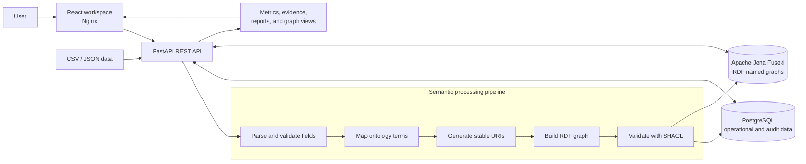

# Circular Electronics Digital Product Passport

A full-stack platform for creating, validating, publishing, and monitoring Digital Product Passports (DPPs) as standards-based knowledge graphs.

The project combines structured product data, RDF ontologies, SHACL validation, SPARQL queries, and semantic-quality monitoring in one reproducible environment.

## Objective

Product sustainability data is often distributed across incompatible systems and difficult to verify. This project provides a traceable semantic layer that allows manufacturers, repair networks, recyclers, and auditors to:

- transform CSV and JSON product records into RDF knowledge graphs;
- validate product claims against explicit SHACL rules;
- publish versioned Digital Product Passports with stable identifiers;
- trace products, components, materials, suppliers, and certificates;
- query and visualize the graph through SPARQL;
- monitor ontology adoption, data quality, vocabulary drift, and validation trends; and
- generate reviewable governance and sustainability evidence.

## How the Solution Works

The platform uses a versioned domain ontology to define circular-electronics concepts and relationships. Uploaded records are parsed, mapped to ontology terms, assigned stable URIs, converted into RDF, and checked against SHACL shapes. Valid passport graphs are stored in Apache Jena Fuseki, while PostgreSQL records products, passport versions, ingestion jobs, validation results, incidents, and governance evidence.

A FastAPI service exposes these capabilities through REST and read-only SPARQL endpoints. The React workspace uses those APIs to provide passport management, ingestion, validation, graph exploration, semantic observability, and reporting views.

## Architecture



The main data flow is:

1. A user uploads a UTF-8 CSV or JSON file through the workspace or API.
2. The backend validates source fields and quarantines invalid records with actionable errors.
3. Valid records are mapped to the DPP ontology and converted into RDF using deterministic URIs.
4. SHACL shapes verify required properties, value ranges, and semantic constraints.
5. PostgreSQL stores operational history; Fuseki stores the resulting named graphs.
6. The API serves passports, graph queries, quality metrics, drift incidents, evidence, and reports to the frontend.

## Core Capabilities

- Product and versioned passport management
- Idempotent CSV and JSON ingestion with quarantine reporting
- RDF generation and named-graph persistence
- SHACL validation with persisted results
- Read-only SPARQL templates and graph exploration
- QR codes and RDF passport exports
- Semantic quality metrics and explainable calculations
- Ontology adoption and vocabulary-drift monitoring
- Evidence review, governance reports, and audit logs
- Deterministic synthetic data and evaluation tooling
- Backup, restore, health checks, metrics, and security checks

## Technology Stack

| Layer | Technology |
| --- | --- |
| Frontend | React, TypeScript, Vite, Cytoscape.js, Nginx |
| API | Python 3.12, FastAPI, Pydantic |
| Semantic processing | RDFLib, pySHACL, OWL/RDFS, SHACL, SPARQL |
| Knowledge graph | Apache Jena Fuseki |
| Operational storage | PostgreSQL 16 |
| Infrastructure | Docker Compose, Redis |
| Testing and quality | pytest, Ruff, mypy, Vitest, TypeScript |

## Run the Application

### Prerequisites

- Docker Desktop with Docker Compose
- PowerShell 7 or Windows PowerShell

### Start with Docker Compose

From the repository root:

```powershell
Copy-Item .env.example .env
docker compose up --build
```

The bootstrap script performs the same setup and creates `.env` when it is missing:

```powershell
.\infrastructure\scripts\bootstrap.ps1
```

Wait for the containers to become healthy, then open:

| Service | URL |
| --- | --- |
| Web application | http://localhost:3000 |
| REST API | http://localhost:8000 |
| OpenAPI documentation | http://localhost:8000/docs |
| Fuseki dataset | http://localhost:3030/dpp |

The local sign-in screen is a demo-only session. Its prefilled credentials can be used to enter the workspace; production identity management is outside this repository's scope.

### Run the Demonstration

To start the stack and execute the reproducible end-to-end flow:

```powershell
.\infrastructure\scripts\demo.ps1 -Start
```

The script creates a sample product and passport, runs SHACL validation, executes a SPARQL query, loads the graph and quality metrics, and writes a cited sustainability report to `artifacts/`.

If the stack is already running, omit `-Start`:

```powershell
.\infrastructure\scripts\demo.ps1
```

## Verification

### Backend

```powershell
cd backend
python -m pip install -e ".[dev]"
ruff check .
mypy app
pytest
```

### Frontend

```powershell
cd frontend
npm ci
npm run typecheck
npm test
npm run build
```

### Semantic and Security Checks

Run these commands from the repository root after installing the backend dependencies:

```powershell
python scripts/validate_ontology.py
python -m pytest tests/semantic tests/synthetic
python scripts/security_scan.py
docker compose config --quiet
```

The live performance suite is opt-in because it requires the running stack:

```powershell
$env:DPP_RUN_LIVE_TESTS = "1"
python -m pytest tests/performance
```

## Repository Structure

```text
backend/          FastAPI application, services, schemas, migrations, and tests
frontend/         React workspace and graph visualization
ontology/         Versioned RDF ontologies, SHACL shapes, fixtures, and registry
sparql/           Reusable competency queries
data/             Seed data, detector configuration, and synthetic scenarios
scripts/          Ontology, security, synthetic-data, and evaluation utilities
infrastructure/   Docker support plus bootstrap, demo, backup, and restore scripts
tests/            Semantic, security, synthetic, evaluation, and performance tests
docs/             Detailed implementation and operations documentation
```

## Operations

Stop the application without deleting its data:

```powershell
docker compose down
```

To remove the local environment and its persisted Docker volumes, use the reset script and confirm the destructive action when prompted:

```powershell
.\infrastructure\scripts\reset-environment.ps1
```

Backup and restore procedures are documented in [Hardening and Operations](docs/12_Hardening_and_Operations.md). The complete design reference is available in the [Digital Product Passport Blueprint](Digital_Product_Passport_BLUEPRINT.md).
